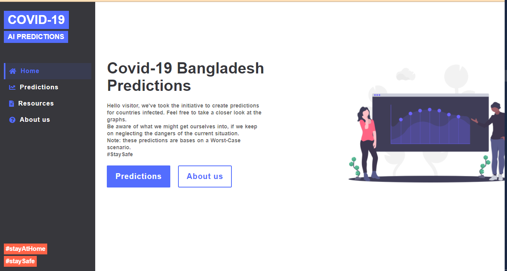
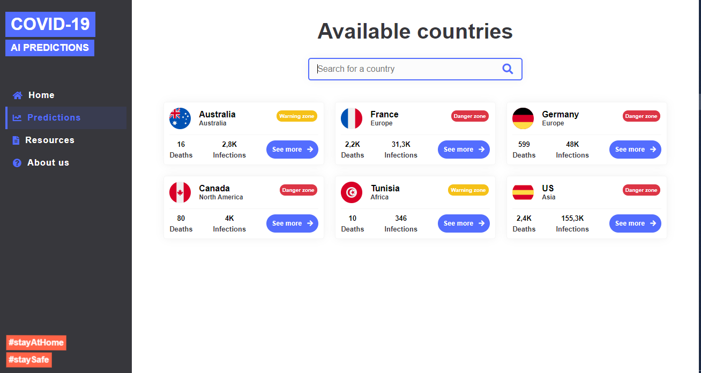

# Covid-19-Bangladesh-Prediction
This Web Application is based on AI. We've taken the data to build predictions for Bangladesh affected by COVID 19. This prediction gives the result by plotting a graph of affected areas. User can know and take necessary precautions by this graph.
# Deloy: AWS | Archive (Snap of website)
[1] [Home Page](https://web.archive.org/web/20210111100615if_/http://3.236.72.244/)
# Home Page 

# Predictions

